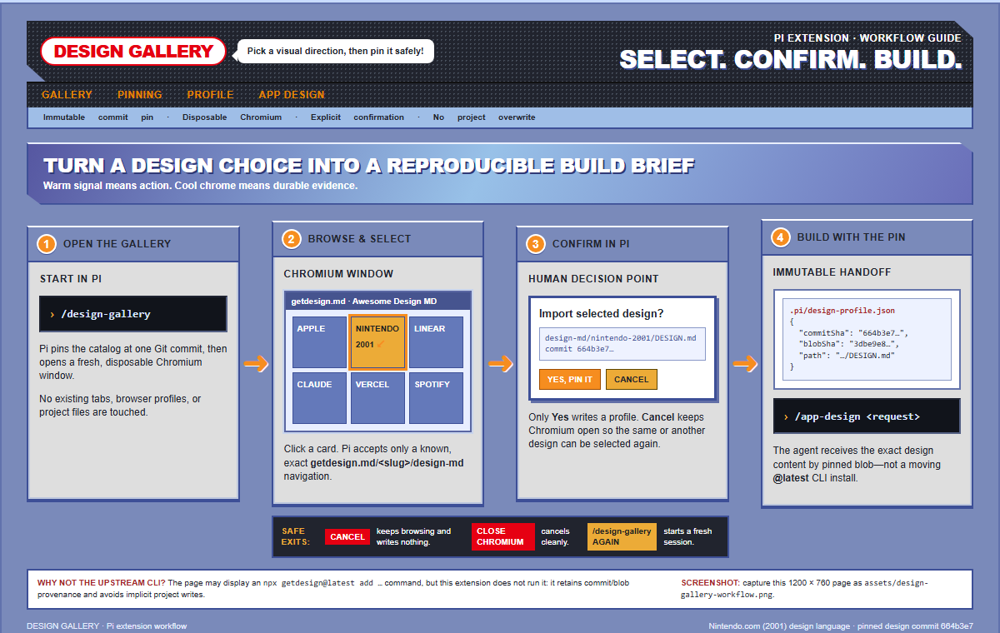

# design-gallery (Pi extension)

Browse the live `VoltAgent/awesome-design-md` catalog through getdesign.md in a
dedicated, disposable Chromium session, confirm a selection, and hand a
commit-pinned `DESIGN.md` off to this Pi agent. Design decisions and evidence
are recorded in `.wayfinder/`; this is the implementation.



## Setup (once per machine)

```bash
cd .pi/extensions/design-gallery
npm install
npx playwright install chromium
```

- `npm install` pulls the `playwright` runtime dependency into this
  extension's own `node_modules/` (jiti resolves it automatically; no global
  install needed).
- `npx playwright install chromium` downloads the bundled Chromium binary
  Playwright drives. Re-run it after upgrading the `playwright` version in
  `package.json`.
- **Windows:** the browser cache defaults to
  `%USERPROFILE%\AppData\Local\ms-playwright`. No admin rights are required;
  if corporate policy blocks the download, set `PLAYWRIGHT_DOWNLOAD_HOST` to
  an internal mirror, or ask an admin to pre-seed that cache directory. There
  is no fallback to a system Chrome/Edge channel in this extension by design
  (see `.wayfinder/Pi-owned browser runtime.md`) — Chromium must be
  installed.
- Optional: set `GITHUB_TOKEN` (a plain personal access token, no scopes
  needed for public repos) to raise the GitHub REST rate limit from
  60/hour to 5,000/hour.

Restart `pi`, or run `/reload`, so the project-local extension at
`.pi/extensions/design-gallery/` is picked up.

## Run

1. `/design-gallery`
   - Pins the current `awesome-design-md` catalog (branch head → commit →
     tree → README preview links).
   - Opens one headed, non-persistent Chromium window at `https://getdesign.md/`.
   - Click a design card. The extension only reacts to an exact
     `https://getdesign.md/<slug>/design-md` main-frame navigation for a slug
     that exists in the pinned catalog — nothing else is observed or scraped.
   - Confirm the import prompt. On "yes", `.pi/design-profile.json` is
     replaced atomically. On "no", keep browsing.
   - Closing the browser window cancels the session; nothing is written.
2. `/app-design <what to build>`
   - Validates `.pi/design-profile.json` (fixed repo, SHA formats, path,
     derived URLs) and fetches `DESIGN.md` by its pinned `blobSha` only —
     never `main`, never the live getdesign.md preview — purely to confirm
     it is still retrievable.
   - Runs one nested, out-of-band completion against the active session
     model, ranking the bundled 20-template `html-effectiveness` catalog
     (pinned commit `58c305be97f47b26b678f2c07dec01d4242268ec`) against your
     request. A valid response must contain exactly three ordered, distinct,
     known template ids with non-empty reasons, plus whether the request
     explicitly delegates the choice — a malformed, incomplete, duplicated,
     or unknown-id response fails the ranking entirely rather than degrading
     to a partial selection.
   - **Explicit delegation** (e.g. "you pick the template", "agent's
     choice"): the top valid recommendation is selected automatically — no
     browser opens.
   - **Manual selection** (no delegation, ambiguous delegation, or the
     ranking itself failed/was invalid): a local, Pi-owned, non-persistent
     Chromium window opens with all 20 templates. When ranking succeeded,
     the 3 recommendations appear first — ranked, badged, with their reasons
     — and are reachable with no scrolling; the complete categorized catalog
     is below, one scroll gesture away at most. Click any card to select it
     (highlighting it, non-color-only: badge text, checkmark, and a status
     line, not just a border color), then click **Confirm selection** — one
     card click plus one confirm click is the full pointer budget. **Cancel**
     is always available, as is closing the window; both end the session
     with nothing selected and nothing sent. Full keyboard support: Tab
     between cards (native `<button>`s, so Enter/Space activates them),
     Escape cancels from anywhere. If ranking failed or returned nothing
     usable, the same gallery opens with every template unranked and a
     visible notice explaining why — manual selection is never blocked by a
     model-formatting problem.
   - Either path writes the full selected template source atomically to
     `.pi/template-selection.json`, then this Pi agent gets a message with
     your request, the pinned design-profile reference, the selected-template
     reference, why it was picked (the model's rationale, or "selected
     manually" for a non-recommended pick), and the precedence contract:
     **the selected template governs structure, information hierarchy, and
     relevant interaction ideas; the pinned `DESIGN.md` governs colors,
     typography, spacing, and component presentation, and overrides any
     styling choices from the template.**
   - If the request is **clearly** delegated but no valid recommendation can
     be obtained, the command stops with a clear error instead of silently
     opening a gallery the user didn't ask to see.
   - Manual selection (the gallery) is **TUI-mode only**. In non-interactive
     or RPC modes, a non-delegated/failed-ranking request returns a clear
     unsupported-mode error; explicit delegation still works in any mode that
     supports nested completion and message handoff.
   - `.pi/template-selection.json` is overwritten only by the next successful
     selection and is never reused as an implicit default for a later
     request.

## Cleanup guarantees

Both browser sessions — `/design-gallery`'s hosted getdesign.md session and
`/app-design`'s local template gallery — are independent, headed,
non-persistent Chromium sessions, each closed on: normal completion,
cancellation (Cancel button, closing the window, or Escape for the template
gallery), a thrown error, browser disconnect, and Pi's `session_shutdown`
event (process exit, `/new`, `/resume`, `/fork`). Re-running either command
while its own session is still open closes the stale one first (each command
tracks its own single active session slot). No CDP, persistent profile, or
existing browser tab is ever used. The template gallery additionally blocks
every network request at the browser-context level and renders every
preview in a sandboxed iframe (no top navigation, popups, or same-origin
access) — nothing in the bundled templates can navigate away from or escape
the gallery page.

## Files

| File | Purpose |
| --- | --- |
| `src/index.ts` | Registers `/design-gallery` and `/app-design`, wires the modules below |
| `src/github.ts` | Catalog discovery + pinned `DESIGN.md` fetch (GitHub REST) |
| `src/browser-session.ts` | Headed non-persistent Playwright Chromium session lifecycle for the hosted getdesign.md gallery (has a runnable self-check) |
| `src/browser-session.selfcheck.ts` | Runnable check for popup capture, dedupe, and cleanup ordering |
| `src/url-allowlist.ts` | Exact getdesign.md selection-URL allow-list (has a runnable self-check) |
| `src/profile.ts` | `.pi/design-profile.json` build, atomic write, strict read/validate |
| `src/types.ts` | Shared types and the profile schema |
| `src/templates/catalog.ts` | Pinned 20-template manifest + vendored-artifact integrity check (has a runnable self-check) |
| `src/templates/vendor/*.html`, `src/templates/vendor/LICENSE` | Verbatim `anthropics/html-effectiveness` templates and upstream MIT notice, pinned at commit `58c305be97f47b26b678f2c07dec01d4242268ec` |
| `src/templates/recommend.ts` | Nested-completion prompt + strict validation of the ranked-recommendation response, plus the lenient delegation-intent peek used only to route ranking failures (has a runnable self-check) |
| `src/templates/model-completion.ts` | Production-only adapter to the active session model via `@earendil-works/pi-ai/compat` (never imported by a self-check) |
| `src/templates/selection-artifact.ts` | `.pi/template-selection.json` build + atomic write |
| `src/templates/gallery-page.ts` | Builds the self-contained local gallery HTML (recommended row, categorized catalog, keyboard/semantic accessibility, escaping) (has a runnable self-check) |
| `src/templates/gallery-session.ts` | Headed non-persistent Playwright Chromium session lifecycle for the local template gallery: network/navigation blocking and main-frame-only `exposeBinding` confirm/cancel callbacks (has a runnable self-check) |
| `src/templates/app-design-command.ts` | Injectable `/app-design` command handler: delegated selection (ticket 01) and manual gallery selection with fallback (ticket 02) |
| `src/templates/app-design-command.selfcheck.ts` | Highest-level runnable self-check at the `/app-design` command boundary |

To exercise the self-checks in isolation (Node 22.6+, no browser, model, or network needed):

```bash
node --experimental-strip-types src/url-allowlist.ts
node --experimental-strip-types src/browser-session.selfcheck.ts
node --experimental-strip-types src/templates/catalog.ts
node --experimental-strip-types src/templates/recommend.ts
node --experimental-strip-types src/templates/gallery-page.ts
node --experimental-strip-types src/templates/gallery-session.selfcheck.ts
node --experimental-strip-types src/templates/app-design-command.selfcheck.ts
```

## Manual acceptance pass (template gallery UX)

The self-checks above are deterministic and browser-free by design (per the
spec's Testing Decisions); the following is real-browser judgment they
cannot cover — run `/app-design <a non-delegated request>` and check:

- **Three-pointer-action budget**: from gallery open, reaching any card takes
  at most one scroll gesture, selecting it is one click, and confirming is
  one more click. The 3 recommended cards need zero scrolling at common
  window sizes.
- **Keyboard-only pass**: Tab reaches every card and both toolbar buttons in
  a logical order; Enter/Space selects a focused card; Escape cancels from
  anywhere; no control is reachable only by mouse.
- **Focus visibility**: the focused card/button always has a clearly visible
  outline, at default zoom and at 150–200% browser zoom.
- **Non-color state**: recommendation, hover, focus, and selected states are
  each distinguishable without color (badge text, checkmark text, outline
  shape) — try it with a grayscale filter or squint test.
- **Fallback gallery**: force a ranking failure (e.g. temporarily break the
  model call) and confirm the gallery still opens, with a visible notice and
  no recommendation badges anywhere.
